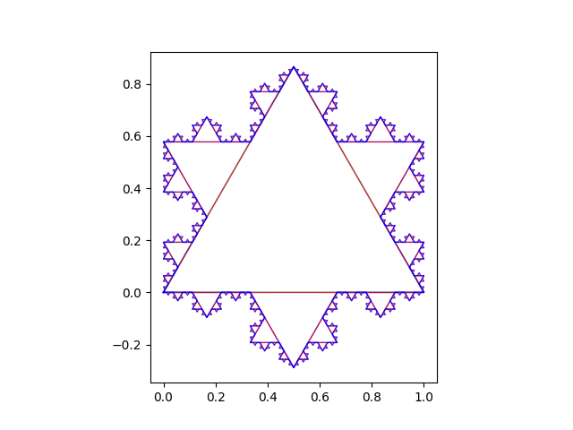
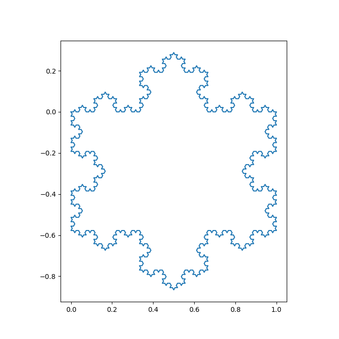

# koch-s-snowflake-
small project exploring how to model repeating patterns in different ways - currently unfinnished. 

"the sample png is from Koch1"

Koch2 represents the remains of the intended pursuit to graph a koch snowflake with inspiration from node and edge mapping from graph theory, it unfortunately was fruitless for mathamatical reasons but never the less remained a fun and interesting piece of code that makes recursive structures with matrix repitition. - try changing the format and position of the M,Z as well as the overall size of the matrix and see what happens. 

koch3 is a rotation based understanding of the pattern, the first moving away from the matrix idea, its unrefined but functional. 

koch4 and koch5 embrace further refinements. 